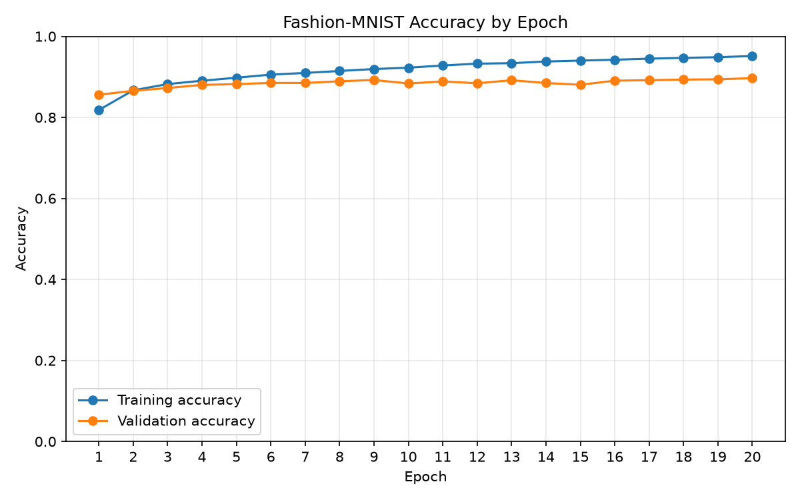

# Repository Summary

## Project purpose

This repository implements a complete PyTorch workflow for classifying
[Fashion-MNIST](https://github.com/zalandoresearch/fashion-mnist) images with a
multilayer perceptron (MLP). The work is split into small Python scripts so each
stage is easy to understand and reuse. Each script can also be pasted, whole,
into its own Jupyter Notebook cell (see [Using the scripts in a Jupyter
Notebook](#using-the-scripts-in-a-jupyter-notebook)). All scripts have been run
end to end; the measured results are in [Results](#results).

## Prompt-to-code walkthrough

The original requests are retained in full in [`PROMPTS.md`](PROMPTS.md). This
section groups each request with the file it produced, so the outcome of every
prompt is clear without having to cross-reference separate sections.

### 1. Dataset preparation → `data.py`

> “The first step is to write `data.py`. This should handle downloading Fashion
> MNIST with torchvision, converting and normalizing vectors to float32 tensors,
> setting the seed (42), splitting the 60,000 training images into 55,000 for
> training and 5,000 for validation, creating dataloaders with batch size 32,
> and whatever else is necessary.”

`data.py` is the shared starting point for all model-related scripts. It sets the
seed to 42, downloads the train and test portions of Fashion-MNIST into `data/`,
and transforms every grayscale image into a normalized `float32` tensor. The
60,000-image training portion is deterministically split into 55,000 training
examples and 5,000 validation examples. It exports `train_dataset`,
`validation_dataset`, `test_dataset`, and their corresponding `DataLoader`
instances. Training batches are shuffled; validation and test batches retain a
fixed order.

### 2. MLP classifier → `model.py`

> “Write `model.py` with a MLP classifier as an `nn.Module`. Flatten the 28x28
> image, then use two hidden layers of 300 and 100 neurons with ReLU. The output
> layer should be 10 logits (one per class).”

`model.py` defines `FashionMNISTClassifier`. Its sequential network flattens a
single 28×28 image to 784 values, applies linear layers with ReLU activations,
and returns 10 logits—one for each Fashion-MNIST class. The default hidden-layer
widths are 300 and 100, while constructor arguments allow `tune.py` to build
models with sampled widths.

### 3. Baseline training → `train.py`

> “Write `train.py` -- train the model with SGD (learning rate 0.1) and
> cross-entropy loss for 20 epochs, using torchmetrics to compute multiclass
> accuracy. For each epoch, record the mean training loss, training accuracy, and
> validation accuracy in a variable and print them. Use a GPU if one is available,
> otherwise CPU is fine. After training, evaluate accuracy on the test set, save
> the model weights, and save the history (including test accuracy).”

`train.py` imports the loaders and default classifier, chooses CUDA when it is
available (otherwise CPU), and trains for 20 epochs with SGD at a learning rate
of 0.1. During every epoch it calculates the mean per-example training loss and
uses `torchmetrics` multiclass accuracy for training and validation accuracy. It
prints those three values, evaluates the finished model on the test split, saves
the artifacts below, and then calls `plot_accuracy` to generate the chart.

### 4. Accuracy chart → `plot.py` and `train.py`

> “Write `plot.py` to plot the training accuracy per epoch. Put validation
> accuracy on the same chart for comparison. Save it as png, but make it display
> them inline when running in Jupyter. Have `train.py` call the plotting after
> training. Regenerate the plots from history.”

`plot.py` reads the JSON history produced by `train.py`. It validates that the
training and validation series have matching, nonzero lengths, draws both
accuracy series against epoch number, writes a PNG image, displays the figure for
notebook use, and closes it afterwards. `train.py` invokes this function after
writing history, and `plot.py` can be run independently after a training run to
regenerate the chart without retraining.

### 5. Validation predictions → `predict.py`

> “Write `predict.py` to use the trained model: take the first 3 images from the
> validation set, print the predicted and true class names, the softmax
> probabilities for all 10 classes (rounded to 3 decimals), and the top 4 most
> likely classes for each image.”

`predict.py` loads the state dictionary saved by baseline training into the
default model architecture and switches the model to evaluation mode. It selects
the first three examples in the validation split, calculates softmax
probabilities, and prints the predicted and true class names, the complete
10-class probability mapping rounded to three decimal places, and the top four
classes for each image.

### 6. Hyperparameter tuning → `tune.py`

> “Use Optuna to search the learning rate (log scale from about 1e-5 to 1e-1),
> the number of neurons in each hidden layer, and the optimizer momentum. Set it
> up to keep things fast; maybe with 10 trials of 5 epochs each. Set up code for
> printing a table of the trials and the best parameters, then for retraining the
> best configuration for 20 epochs and report its test accuracy compared with the
> baseline from `train.py`.”

`tune.py` first reads the baseline test accuracy from the history JSON. Optuna
then runs 10 trials; each trains a newly sampled MLP for 5 epochs and uses its
validation accuracy as the objective. The search samples a log-scale learning
rate from 1e-5 through 1e-1, first and second hidden-layer widths, and SGD
momentum. After printing the completed trials and winning parameters, it
rebuilds the best model, trains it for 20 epochs, reports validation accuracy at
each retraining epoch, evaluates it on the test set, compares that result with
the baseline, and saves a JSON record of the experiment. The Optuna sampler is
seeded (42) so the same trials are drawn on every run.

### 7. Repository summary → `SUMMARY.md`

> “Based on `PROMPTS.md`, can you make a repository summary that summarizes all
> our dialogue?”

This file. It walks through every prompt in `PROMPTS.md`, pairs it with the code
it produced, and documents how to run the project and what it outputs.

### 8. Finishing the project → `.gitignore`, notebook fixes, and results

> “Could you finish Codex's job by doing the following? 1. Add a git ignore
> 2. Run the files in order 3. Update the summary with results 4. Update the
> Python files to allow clean pasting into a notebook 5. Add the below prompt to
> PROMPTS.md (and SUMMARY.md if necessary)”

Codex could not import PyTorch or the other libraries in its environment, so
none of the scripts had actually been run. This request was completed in Claude
Code, which:

- added a `.gitignore` that excludes the downloaded `data/` directory, Python
  caches, virtual environments, and Jupyter checkpoints, while keeping the
  `artifacts/` outputs under version control;
- ran every script in order and committed the resulting model weights, history,
  plot, and tuning results in `artifacts/` (see [Results](#results));
- made the scripts paste cleanly into notebook cells (details in [Using the
  scripts in a Jupyter
  Notebook](#using-the-scripts-in-a-jupyter-notebook)); and
- logged the summary prompt and this request in `PROMPTS.md`.

## Results

All numbers below come from one CPU run of the scripts in order (PyTorch 2.14,
seed 42). Accuracies are fractions of correctly classified images.

### Baseline MLP (`train.py`): 300 → 100 hidden units, SGD, learning rate 0.1, 20 epochs

| Epoch | Train loss | Train accuracy | Validation accuracy |
| ----: | ---------: | -------------: | ------------------: |
| 1 | 0.4931 | 0.8182 | 0.8558 |
| 2 | 0.3587 | 0.8668 | 0.8655 |
| 3 | 0.3165 | 0.8822 | 0.8725 |
| 4 | 0.2909 | 0.8905 | 0.8802 |
| 5 | 0.2673 | 0.8979 | 0.8820 |
| 6 | 0.2512 | 0.9056 | 0.8851 |
| 7 | 0.2373 | 0.9096 | 0.8848 |
| 8 | 0.2246 | 0.9145 | 0.8891 |
| 9 | 0.2103 | 0.9193 | 0.8923 |
| 10 | 0.2030 | 0.9226 | 0.8836 |
| 11 | 0.1895 | 0.9280 | 0.8887 |
| 12 | 0.1794 | 0.9326 | 0.8842 |
| 13 | 0.1721 | 0.9338 | 0.8917 |
| 14 | 0.1637 | 0.9379 | 0.8848 |
| 15 | 0.1586 | 0.9401 | 0.8804 |
| 16 | 0.1528 | 0.9423 | 0.8906 |
| 17 | 0.1436 | 0.9449 | 0.8917 |
| 18 | 0.1392 | 0.9469 | 0.8933 |
| 19 | 0.1339 | 0.9485 | 0.8940 |
| 20 | 0.1272 | 0.9515 | 0.8968 |

**Baseline test accuracy: 0.8906.**

Training accuracy climbs steadily to 95.2%, while validation accuracy levels
off around 88–90% after roughly epoch 8. The widening gap (about 5.5 points by
epoch 20) is mild overfitting; more epochs alone would be unlikely to improve
the validation or test score much.

### Predictions on the first three validation images (`predict.py`)

| Image | True class | Predicted class | Top 4 classes (probability) |
| ----: | ---------- | --------------- | --------------------------- |
| 1 | Sneaker | Sneaker | Sneaker 1.000, Ankle boot 0.000, Sandal 0.000, Coat 0.000 |
| 2 | Coat | Coat | Coat 0.990, Pullover 0.010, Shirt 0.000, Trouser 0.000 |
| 3 | Pullover | Pullover | Pullover 0.897, Shirt 0.101, Coat 0.001, T-shirt/top 0.001 |

All three are correct. The model is least certain on the pullover, which it
partly confuses with a shirt, one of the classic hard pairs in Fashion-MNIST.

### Hyperparameter tuning (`tune.py`): 10 Optuna trials × 5 epochs

| Trial | Validation accuracy | Learning rate | Hidden 1 | Hidden 2 | Momentum |
| ----: | ------------------: | ------------: | -------: | -------: | -------: |
| 0 | 0.7798 | 0.000315 | 512 | 192 | 0.569 |
| 1 | 0.6566 | 0.000042 | 128 | 32 | 0.823 |
| **2** | **0.8730** | **0.002538** | **384** | **32** | **0.921** |
| 3 | 0.8648 | 0.021368 | 128 | 64 | 0.174 |
| 4 | 0.6964 | 0.000165 | 320 | 128 | 0.277 |
| 5 | 0.8466 | 0.002802 | 128 | 96 | 0.348 |
| 6 | 0.8094 | 0.000667 | 448 | 64 | 0.489 |
| 7 | 0.8298 | 0.002342 | 64 | 160 | 0.162 |
| 8 | 0.6044 | 0.000018 | 512 | 256 | 0.768 |
| 9 | 0.7128 | 0.000165 | 64 | 192 | 0.418 |

Best trial: learning rate ≈ 0.00254, hidden layers 384 and 32, momentum ≈ 0.921.
Retrained for 20 epochs, it reached 0.8948 validation accuracy in the final
epoch.

| Model | Test accuracy |
| ----- | ------------: |
| Baseline (`train.py`) | 0.8906 |
| Tuned best configuration (`tune.py`) | 0.8889 |
| Difference | −0.0017 |

The tuned model did **not** beat the baseline; the two are effectively tied.
Several things explain this:

- **Small search.** Ten trials is very few for four hyperparameters, and half
  of them sampled learning rates below 0.001, which learn too slowly to be
  competitive in 5 epochs.
- **Short trials favour fast learners.** Ranking by accuracy after 5 epochs
  rewards configurations that improve quickly, not necessarily those that end
  best after 20 epochs.
- **A strong baseline.** A learning rate of 0.1 is already close to a good
  value for this network. The best trial effectively reached a similar step size
  through momentum: 0.00254 / (1 − 0.921) ≈ 0.032.
- **Run-to-run noise.** A 0.17-point difference is within the variation you
  would expect from a different random initialization, so it is not evidence
  that either model is better.

A larger search (more trials, a pruner such as Optuna's `MedianPruner`, and
longer trials) would be the natural next step.

## Full execution order

1. Install the Python dependencies used by the scripts:
   `pip install torch torchvision torchmetrics matplotlib optuna`.
2. From the repository root, run `python train.py`. This also downloads
   Fashion-MNIST automatically on its first run and creates the baseline model,
   metric history, and accuracy plot.
3. Optionally run `python plot.py` to recreate the baseline plot from the saved
   history without retraining.
4. Run `python predict.py` to inspect predictions from the saved baseline model.
5. Optionally run `python tune.py` to search the configured hyperparameters and
   compare the retrained best configuration with the saved baseline. This step
   requires `train.py` to have completed successfully because it reads the
   baseline history file.

## Using the scripts in a Jupyter Notebook

Paste each file, whole, into its own cell and run the cells in this order:

1. `data.py`
2. `model.py`
3. `plot.py`: must come before `train.py`, because training calls
   `plot_accuracy`. On a fresh run it prints a note that there is no history
   yet instead of failing.
4. `train.py`: trains the model and displays the accuracy chart inline.
5. `predict.py`
6. `tune.py`

The scripts were changed so that this works cleanly:

- **Imports between files are guarded.** `train.py`, `predict.py`, and
  `tune.py` only run `from data import ...`, `from model import ...`, or
  `from plot import ...` when those names are not already defined. In a
  notebook they reuse the objects from earlier cells, so data is not loaded
  twice and the `.py` files do not need to be next to the notebook. Run as
  scripts, they import from the sibling files as before.
- **No name clashes.** `tune.py`'s accuracy helper is now called
  `evaluate_trial_accuracy`. Previously it was named `evaluate_accuracy` with a
  different signature from the function in `train.py`, so pasting `tune.py`
  would have broken any later call to `train_model()` in the same notebook.
- **`plot.py` can run before training**, as described above.
- **Run blocks work in notebooks.** Jupyter sets `__name__` to `"__main__"`,
  so each cell's `if __name__ == "__main__":` block runs just as it does from
  the command line.

This was verified by running all six files in order in one shared namespace,
with the repository removed from Python's import path, then calling
`train_model()` again after `tune.py`.

## Generated files and directories

The scripts create files that are intentionally not source code:

- `data/` contains the downloaded Fashion-MNIST data. It is listed in
  `.gitignore` because `data.py` downloads it again automatically.
- `artifacts/fashion_mnist_mlp.pt` contains the baseline model state dictionary.
- `artifacts/fashion_mnist_history.json` contains per-epoch baseline training
  loss, training accuracy, validation accuracy, and final test accuracy.
- `artifacts/fashion_mnist_accuracy.png` contains the baseline accuracy chart.
- `artifacts/fashion_mnist_tuning_results.json` contains the best sampled
  parameters, baseline and tuned test accuracies, and all trial results.

Everything in `artifacts/` is committed so the results above can be inspected
without rerunning anything. The baseline model and history are inputs to later stages: `predict.py` needs the
model state dictionary, and `tune.py` needs the history JSON. Training can be
re-run to overwrite the baseline model, history, and plot with a new run.
